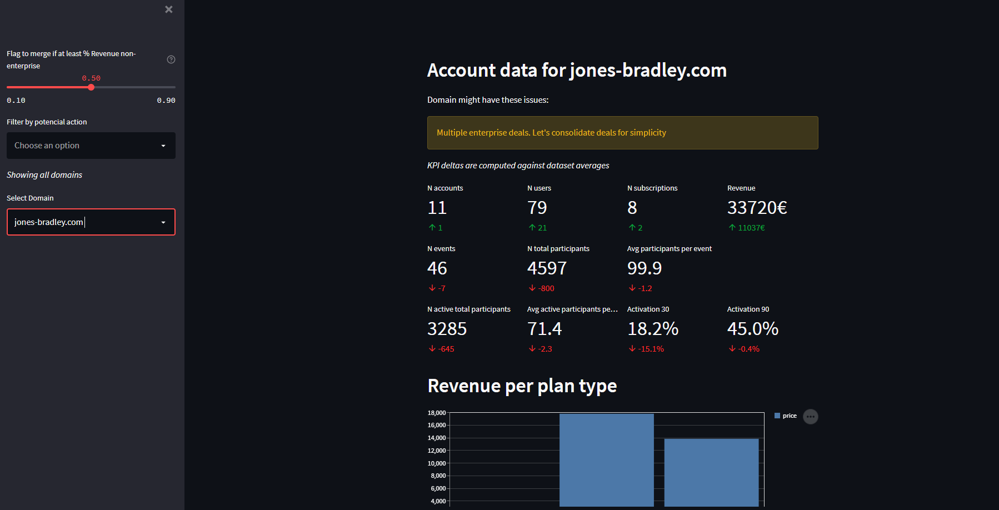
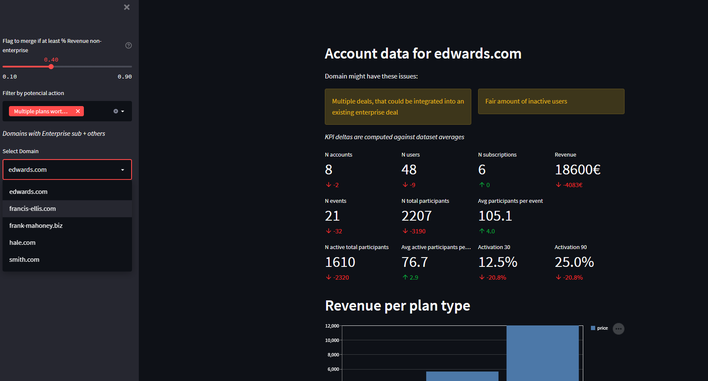

##About

So, the way i feel about these assignments is, that they are meant to show how a person thinks,
how he solves issues, which tools he is capable at etc. It's imho not about having the answers to the problem,
as it most likely was solved already. Hence, some parts might not be strictly speaking according to the
assignment description (like notebooks...god, i dislike notebooks a lot).
I just went with it the way i would in real life, if I had no option to inquire regarding expectations,
 clarification and so on.

Btw, i went for Streamlit, as I've been dying to try it out in something "real". As am trying for like a 2nd time,
it's definitely obvious, that the viz part could be improved a lot...If it were a real thing, I would give it more love,
 that's for sure.

Alright, here we go:

# How to run
Run with
`docker compose up`

Then, access at http://localhost:8501/

## Data&SQL
Asked SQL queries are found in _./data/grouping.sql_, however this one is not used.
Iam rather using _./data/stats_per_acc.sql_,
which does not do the final grouping, as I prefer to do it in Pandas.

Not much to comment here I suppose, maybe apart sharing the fact, that I had fair difficulties with them actually.
I was expect something quite hard, so when I made the queries easily, I was like back at math class, when you finish 
the assignment, and you are like damn, that was easy. And everybody else is sweating their ***** off, so you're like
oh damn, I must have made a mistake. So I actually had to go through it couple of times...

Well, if they are wrong, it's going to be quite embarrassing, because if the data are wrong, the analysis is
quite pointless. Hence, in real life, I would have asked somebody, who actually understands the data, to verify.

## The code

Not much to comment I'd say. Tried to make it quite self explanatory. Maybe project structure could have been
bit nicer, but for assignment purposes I would argue it hardly matters.

Maybe also worth noting, there is a super simple validation in the data loading part to ensure certain assumptions
about the data are met.

## Analysis/output
Generally, Iam not used to creating reports, but rather interactive dashboards, so I went for it. It would have
been up to the user to figure out concrete clients to investigate.

The requested metrics are shown as KPI's, also with comparison to the mean of the dataset. Gives at least bit of context.

Alright, maybe for Pali it would have been clear from the requested information, but for somebody who does
not work with the data, it wasn't. Hence, I made a sort of tagging to flag domains based on certain criteria
I thought of based from the data. They are:

* Inactive accounts - I would suspect, that if a client has a lot of inactive users, he is not using the company
    services, so he might not feel justified to pay for it in the future, so it might be worth contacting him and
    selling him the strengths of the tool
* Multiple enterprise deals - I am not certain, why a company might want to have multiple enterprise deals, so it 
    seemed to me worth noting those, as it might be worth merging those to simplify invoicing or something.
* No enterprise deals
* Multiple plans worth merging

But most important two are *No enterprise deals* and *multiple plans worth merging*, as they have tied a monetary
value to them.
The only deal with no enterprise licence seems to be _"wilson.org"_, so that should be a prime target to contact
with a new deal. Also his revenue is not completely trivial

Afterwards i looked into domains, that do have enterprise deals + some smaller deals. Here I noticed that it 
barely makes sense to contact domains with ~95% revenue coming from enterprise, so i adjusted calculation to
flag only those domains, that are not like that. At first I thought hardcoding a threshold was a good idea,
but later i decided to add a slider to adjust such a threshold. To critique quite a bit, it's really not clear how it 
works so it should be reworked to be more transparent.

Nevertheless, here for instance are domain's i would say are worth contacting to upsale the deal, as they have 
atleast 50% of revenue comming from non-enterprise deals. Namely edwards.com, francis.ellis.com, frank mahoney.biz, hale.com, smith.com

## Summary
I hope i did get the SQL right, otherwise everything is pointless.

I created interactive dashboard in Streamlit for user to explore the data. Try it out with `docker compose up`.

Domains were tagged in order to classify what sort of action (if any) could be taken.
Most notables are wilson.org, edwards.com, francis.ellis.com, frank mahoney.biz, hale.com, smith.com. I would point Pali's direction 
towards those. There are also domains, that are surprisingly inactive, so it might be worth checking out as well.

Streamlit is awesome, but the basic formatting is a shame. The bars with gridlines and no values, the table that's 
weirdly aligned...But still, it's really simple concept and i like that.

.gitignore is missing, shame

 

